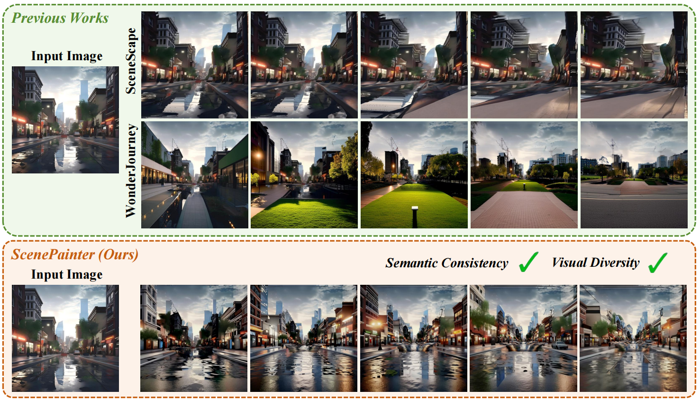
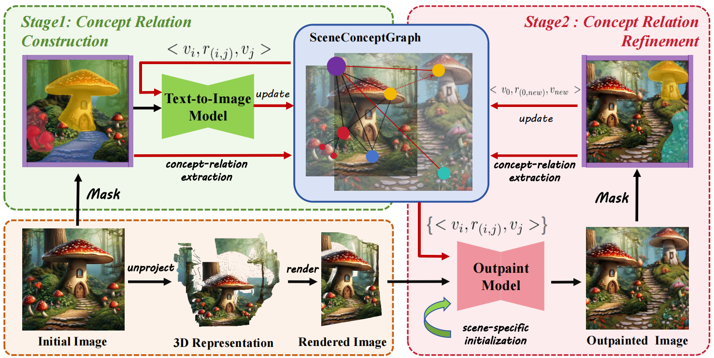

<div align="center">

# ✨ScenePainter: Semantically Consistent Perpetual 3D Scene Generation with Concept Relation Alignment✨

<p align="center">
<a href="https://xiac20.github.io/">Chong Xia</a>,
                <a href="https://shengjun-zhang.github.io/">Shengjun Zhang</a>,
                <a href="https://liuff19.github.io/">Fangfu Liu</a>,
                Chang Liu,
                Khodchaphun Hirunyaratsameewong,
                <a href="https://duanyueqi.github.io/">Yueqi Duan<sup>†</sup></a>
<br>
    Tsinghua University     
</p>
<h3 align="center">ICCV 2025 🔥</h3>
<a href="https://arxiv.org/abs/2507.19058"></a> &nbsp;&nbsp;&nbsp;&nbsp;
<a href="https://xiac20.github.io/ScenePainter"></a> &nbsp;&nbsp;&nbsp;&nbsp;
<!-- <a href="https://huggingface.co/chijw/LangScene-X"></a> &nbsp;&nbsp;&nbsp;&nbsp; -->
<a></a> &nbsp;&nbsp;&nbsp;&nbsp;


</div>

**ScenePainter:** We propose ScenePainter, which aims to generate semantically consistent yet visually diverse 3D view sequences starting from a single view.

## 📢 News
- 🔥 [28/07/2025] We release "ScenePainter: Semantically Consistent Perpetual 3D Scene Generation with Concept Relation Alignment". Check our [project page](https://xiac20.github.io/ScenePainter) and [arXiv paper](https://arxiv.org/abs/2507.19058).

## 🌟 Pipeline



Pipeline of ScenePainter. We propose a two-stage framework that first constructs scene concept relations with the graph structure sceneConceptGraph, and further aligns the outpainting model with the scene-specific prior during the ongoing painting process.


## 🎨 Video Demos

<video width="100%" controls autoplay loop muted>
  <source src="assets/demo.mp4" type="video/mp4">
</video>

## ⚙️ Setup

### 1. Clone Repository
```bash
git clone https://github.com/xiac20/ScenePainter.git
cd ScenePainter
```
### 2. Environment Setup

1. **Create conda environment**

```bash
conda create -n scenepainter python=3.10 -y
conda activate scenepainter
```
2. **Install dependencies**
```bash
conda install pytorch=1.13.0 torchvision pytorch-cuda=11.6 -c pytorch -c nvidia
conda install -c fvcore -c iopath -c conda-forge fvcore iopath
conda install -c bottler nvidiacub
conda install pytorch3d -c pytorch3d
pip install -r requirements.txt
```

3. **Additional Setup**
```bash
# Load English language model for spacy
python -m spacy download en_core_web_sm

# Export your OpenAI api_key (since we use GPT-4 to generate scene descriptions)
export OPENAI_API_KEY='your_api_key_here'

# Download Midas DPT model and put it to the root directory
wget https://github.com/isl-org/MiDaS/releases/download/v3_1/dpt_beit_large_512.pt
```

<!-- ### 3. Model Checkpoints
The checkpoints of SAM, SAM2 and fine-tuned CogVideoX can be downloaded from our [huggingface repository](https://huggingface.co/chijw/LangScene-X). -->

## 💻Run Examples

We provide three example scenes to help you get started. You can also create your own scenes following the same structure.

### 1. Generate similar images for diversity (Optional)

```bash
python bas_module/img_generator.py --dataset_dir examples/village
```

### 2. Train the T2I model with scene-level concepts and relations

```bash
python bas_module/train.py  --instance_data_dir examples/village  --num_of_assets 5  --initializer_tokens village sky house path stone  --no_prior_preservation  --phase1_train_steps 400  --phase2_train_steps 400  --output_dir painters/village  --log_checkpoints
```

### 3. Test the extracted T2I model

```bash
python inference.py --model_path painters/village  --num_of_assets 5  --output_path result.jpg
```

### 4. Finetune the extracted T2I model for perpetual image generation

```bash
python run.py --example_config config/village.yaml
```


## 🔗Acknowledgement

We are thankful for the following great works when implementing ScenePainter:

- [WonderJourney](https://github.com/KovenYu/WonderJourney), [Break-A-Scene](https://github.com/google/break-a-scene), [Blended Diffusion](https://github.com/omriav/blended-diffusion), [SAM](https://github.com/facebookresearch/segment-anything)

## 📚Citation

```bibtex
@misc{xia2025scenepaintersemanticallyconsistentperpetual,
        title={ScenePainter: Semantically Consistent Perpetual 3D Scene Generation with Concept Relation Alignment}, 
        author={Chong Xia and Shengjun Zhang and Fangfu Liu and Chang Liu and Khodchaphun Hirunyaratsameewong and Yueqi Duan},
        year={2025},
        eprint={2507.19058},
        archivePrefix={arXiv},
        primaryClass={cs.CV},
        url={https://arxiv.org/abs/2507.19058}, 
      }
```
